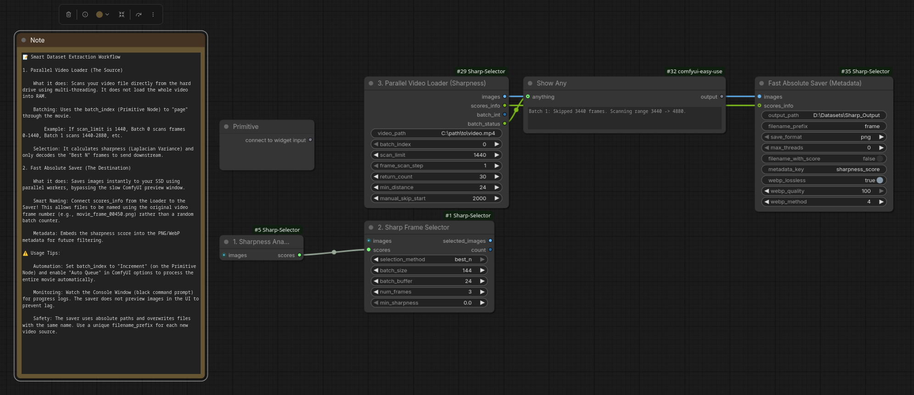

# ComfyUI Sharpness Helper Nodes

A high-performance custom node suite for **ComfyUI** designed to detect blur, calculate sharpness scores (Laplacian Variance), and efficiently extract or filter the best frames from videos and image batches.

This pack solves two major problems in AI video workflows:
1. **Dataset Creation:** Extracting only the sharpest frames from massive movie files without crashing RAM.
2. **Generation Filtering:** Automatically discarding blurry frames from AnimateDiff or img2img outputs.

---

---

## 🚀 Key Features

### 1. Parallel Video Loader (Path-Based)
* **Zero-RAM Scanning:** Scans video files directly from disk without decoding every frame to memory.
* **Multi-Threaded:** Uses all CPU cores to calculate sharpness scores at high speed (1000s of frames per minute).
* **Smart Batching:** Includes an auto-incrementing "Page" system to process long movies in chunks (e.g., minute-by-minute) without restarting ComfyUI.
* **Lazy Loading:** Only decodes and loads the final "Best N" frames into ComfyUI tensors.

### 2. Fast Absolute Saver (Metadata)
* **Multi-Threaded Saving:** Spawns parallel workers to saturate SSD write speeds (bypassing standard PIL bottlenecks).
* **No UI Lag:** Saves images in the background without trying to render Base64 previews in the browser, preventing interface freezes.
* **Metadata Embedding:** Automatically embeds the sharpness score into the PNG/WebP metadata for dataset curation.
* **Smart Naming:** Uses original video frame numbers in filenames (e.g., `frame_001450.png`) instead of arbitrary counters.

### 3. Standard Sharpness Duo (Tensor-Based)
* **Workflow Integration:** Works with any node that outputs an `IMAGE` batch (e.g., AnimateDiff, VideoHelperSuite).
* **Precision Filtering:** Sorts and filters generated frames before saving or passing to a second pass (img2img).

---

## 📦 Installation

1.  Clone this repository into your `custom_nodes` folder:
    ```bash
    cd ComfyUI/custom_nodes/
    git clone [https://github.com/YOUR_USERNAME/ComfyUI-Sharpness-Helper.git](https://github.com/YOUR_USERNAME/ComfyUI-Sharpness-Helper.git)
    ```
2.  Install dependencies (if needed):
    ```bash
    pip install opencv-python numpy
    ```
3.  Restart ComfyUI.

---

## 🛠️ Node Documentation

### 1. Parallel Video Loader (Sharpness)
**Category:** `BetaHelper/Video`

This is the recommended node for **Dataset Creation** or finding good frames in **Long Movies**. It inputs a file path, scans it in parallel, and only loads the final "Best N" frames into memory.

| Input | Description |
| :--- | :--- |
| **video_path** | Absolute path to your video file (e.g., `D:\Movies\input.mp4`). |
| **batch_index** | **Critical.** Connect a **Primitive Node** here set to `increment`. This controls which "chunk" of the video you are viewing. |
| **scan_limit** | How many frames to process per batch (e.g., `1440`). |
| **frame_scan_step** | Speed up scanning by checking every Nth frame (e.g., `5` checks frames 0, 5, 10...). |
| **manual_skip_start** | Global offset (e.g., set to `2000` to always ignore the opening credits). |

**Outputs:**
* `images`: The batch of the sharpest frames found.
* `scores_info`: String containing frame indices and scores (Connect to Saver).
* `batch_int`: The current batch number.
* `batch_status`: Human-readable status (e.g., *"Batch 2: Skipped 2880 frames..."*).

> **💡 Pro Tip:** To scan a movie continuously, connect a **Primitive Node** to `batch_index`, set it to **increment**, and enable "Auto Queue" in ComfyUI.

---

### 2. Fast Absolute Saver (Metadata)
**Category:** `BetaHelper/IO`

A "Pro-Grade" saver designed for speed. It bypasses relative paths and UI previews.

| Input | Description |
| :--- | :--- |
| **output_path** | Absolute path to save folder (e.g., `D:\Datasets\Sharp_Output`). |
| **filename_prefix** | Base name for files (e.g., `matrix_movie`). |
| **max_threads** | **0 = Auto** (Uses all CPU cores). Set manually to limit CPU usage. |
| **save_format** | `png` (Fastest) or `webp` (Smaller size). |
| **filename_with_score** | If True, appends score to filename: `frame_001450_1500.png`. |
| **scores_info** | Connect this to the `scores_info` output of the Parallel Loader to enable smart naming. |

**Performance Note:**
* **PNG:** Uses `compress_level=1` for maximum speed.
* **WebP:** Avoid `webp_method=6` unless you need max compression; it is very CPU intensive. `4` is the recommended balance.

---

### 3. Sharpness Analyzer & Selector (The Duo)
**Category:** `BetaHelper/Image`

Use these when you already have images inside your workflow (e.g., from a generation or a standard Load Video node).

#### Node A: Sharpness Analyzer
* **Input:** `IMAGE` batch.
* **Action:** Calculates the Laplacian Variance for every image in the batch.
* **Output:** Passes the images through + a generic score list.

#### Node B: SharpFrame Selector
* **Input:** `IMAGE` batch (from Analyzer).
* **Action:** Sorts the batch based on the scores and picks the top N frames.
* **Output:** A reduced batch containing only the sharpest images.

---

## ⚖️ Which Node Should I Use?

| Feature | **Parallel Video Loader** | **Standard Duo** |
| :--- | :--- | :--- |
| **Input Type** | File Path (`String`) | Image Tensor (`IMAGE`) |
| **Best For** | **Long Videos / Movies** | **Generations / Short Clips** |
| **Memory Usage** | Very Low (Only loads final frames) | High (Loads all frames to RAM first) |
| **Speed** | ⚡ **Ultra Fast** (Multi-core) | 🐢 Standard (Single-core) |
| **Workflow Stage** | Start of Workflow | Middle/End of Workflow |

---

## 📝 Example Workflows

### Batch Processing a Movie for Training Data
1.  Add **Parallel Video Loader**.
2.  Connect a **Primitive Node** to `batch_index` (Control: `increment`).
3.  Set `scan_limit` to `1000` and `frame_scan_step` to `5`.
4.  Connect `images` and `scores_info` to **Fast Absolute Saver**.
5.  Enable **Auto Queue** in ComfyUI extra options.
    * *Result: ComfyUI will loop through your movie, extracting the 4 sharpest frames from every ~1000 frame chunk automatically.*

### Filtering AnimateDiff Output
1.  AnimateDiff Generation -> **Sharpness Analyzer**.
2.  Analyzer Output -> **SharpFrame Selector** (Select Best 1).
3.  Selector Output -> **Face Detailer** or **Upscaler**.
    * *Result: Only the clearest frame from your animation is sent to the upscaler, saving time on blurry frames.*

---

## Credits
* Built using `opencv-python` for Laplacian Variance calculation.
* Parallel processing logic for efficient large-file handling.